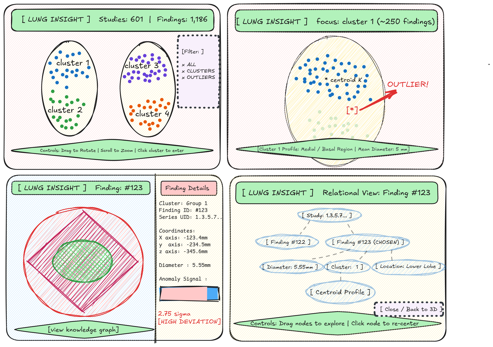

# lung-analysis-demo
A Three.js and vis.js visual mockup demo.

Obtained `annotations.csv` from the [LUNA16 Kaggle Dataset](https://www.kaggle.com/datasets/eliasmarcon/luna-16), which contains annotations for 1,186 nodule findings across CT studies.

The annotations.csv file contains the following columns:
- `seriesuid`: DICOM Series Instance UID for the CT scan session.
- `coordX`: Nodule center X coordinate (mm).
- `coordY`: Nodule center Y coordinate (mm).
- `coordZ`: Nodule center Z coordinate (mm).
- `diameter_mm`: Measured diameter of the nodule (mm).

## Data Dictionary

| Column | Type | Source | Description |
| :--- | :--- | :--- | :--- |
| `seriesuid` | String | LUNA16 | Unique CT acquisition identifier (serial id). |
| `coordX` | Float | LUNA16 | Coronal/Sagittal physical position in millimeters. |
| `coordY` | Float | LUNA16 | Anterior/Posterior physical position in millimeters. |
| `coordZ` | Float | LUNA16 | Axial physical position in millimeters (slice position). |
| `diameter_mm` | Float | LUNA16 | Longest cross-sectional diameter in millimeters. |

## Interface Design & Wireframes

The 4 core interface states were made in [Excalidraw](https://excalidraw.com) to establish spatial hierarchy, interaction flows, and camera transitions before frontend development:

1. **Macro Overview**: Full 3D coordinate space with faint anatomical lung silhouettes, global dataset indicators (601 studies, 1,186 findings), and filter controls.
2. **Cluster Focus**: Zoomed view isolating a single cluster, dimming background groups to reveal peripheral outlier points.
3. **Finding Details**: Direct target lock on a single nodule accompanied by a side panel displaying coordinates, diameter, and relative centroid distance.
4. **Relational Knowledge Graph**: A 2D vis.js network view mapping parent `Study (seriesuid)` down to `Finding`, `Cluster`, and measurement properties.

## Clinical Boundary
This prototype is built strictly for pattern discovery and visual exploration. It does not provide medical diagnoses.